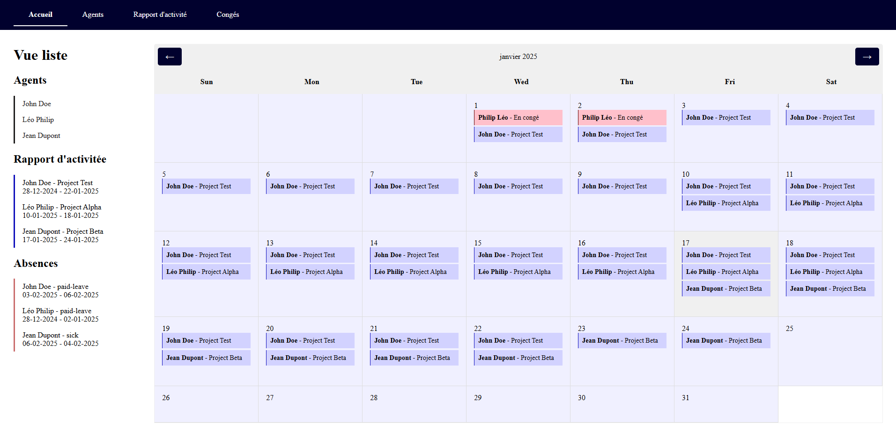
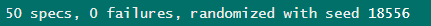
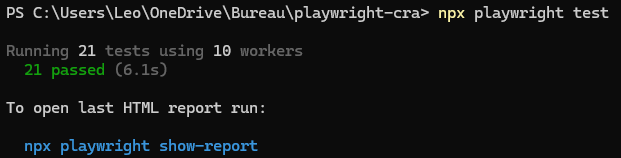

# Opération CRA



## Contexte

L'application "Opération CRA" a été développée pour Groupama Gan Vie dans le but de gérer les comptes rendus d'activité (CRA) de leurs agents spéciaux. Cette application Angular permet de suivre les efforts des agents sur différents projets, de gérer leurs congés et d'ajouter de nouveaux agents selon les besoins.

- Congés : Lorsqu'un congé est demandé, le système autorise jusqu'à 5 jours pour les congés payés. Les congés maladie ne décomptent pas les jours de congés payés.
- Chevauchements : Vérifications intégrées pour éviter les chevauchements d'activités pour le même utilisateur, ainsi que les chevauchements entre les activités et les congés.
- Modification de CRA : Les rapports d'activité peuvent être modifiés via une pastille sur le calendrier.
- Modification des congés : Les congés sont également modifiables via une pastille sur le calendrier.
- Navigation : La navigation est limitée à une période de 3 mois pour une gestion plus efficace.
- Suppression d'Agents : La suppression d'un agent entraîne la suppression en cascade de tous ses rapports et congés associés dans le calendrier.
- Gestions multiagents: Nous avons trois agents à l'initialisation de l'application, nous pouvons en ajouter plus si l'équipe grandit.

## Lancer le Projet avec Angular

Pour lancer le projet en utilisant Angular, suivez ces étapes :

1. Clonez le dépôt GitHub :
    ```bash
    git clone https://github.com/LeoPhilip33/Operation_CRA.git
    ```

2. Accédez au répertoire du projet :
     ```bash
     cd Operation_CRA
     ```

 3. Installez les dépendances :
     ```bash
     npm install
     ```

4. Démarrez le serveur de développement Angular :
    ```bash
    ng serve
    ```

5. Accédez à l’application via votre navigateur à l’adresse [http://localhost:4200](http://localhost:4200)

## Déploiement sur Vercel

L’application “Opération CRA” est déployé automatiquement au push sur main via Vercel. Vous pouvez y accéder via le lien : [Opération CRA](https://operation-cra.vercel.app/)

## Dockerisation

Le projet a également été dockerisé. Voici les étapes pour lancer le projet avec Docker :

1. Assurez-vous d’avoir [Docker](https://www.docker.com/) installé sur votre machine.

2. Accédez au répertoire du projet précédemment cloné :
    ```bash
    cd Operation_CRA
    ```

3. Construisez l’image Docker :
    ```bash
    docker build -t operation-cra .
    ```

4. Construisez l’image Docker :
    ```bash
    docker run -d -p 8080:80 operation-cra
    ```

5. Accédez à l’application dockérisé via votre navigateur à l’adresse [http://localhost:8080](http://localhost:8080)

# Test Unitaires
Ce projet inclut des tests unitaires pour garantir le bon fonctionnement des composants. Les tests sont écrits en utilisant le framework Jasmine et exécutés avec Karma.

```bash
ng tests
```



AgentFormComponent
- should display error message when lastName is invalid
- should add agent when form is valid
- should display error message when firstName is invalid

LeaveComponent
- should render the header component
- should have a container with class "container-leave"
- should render the leave form component
- LeaveFormComponent
- should call onSubmit when form is submitted

ActivityReportFormComponent
- should display "Modifier une activité" when an activity report is selected
- should display error message when agentId is invalid
- should display error message when project is invalid
- should call onSubmit when form is submitted
- should display "Reporter une activité" when no activity report is selected

AgentsComponent
- should contain container-agents class
- should have app-agent-form inside container-agents
- should render HeaderComponent
- should render AgentFormComponent

HomeComponent
- should render the list of leaves
- should render the list of activity reports
- should close the dialog when the close button is clicked
- should render the header component
- should render the list of agents
- should render the calendar component

HeaderComponent
- should navigate to "agents" when clicking the Agents link
- should contain navigation links
- should navigate to "leave" when clicking the Leave link
- should navigate to "activity-report" when clicking the Activity Report link
- should not have "active" class on inactive routes
- should add "active" class when on the current route

CalendarComponent
- should emit viewLeave event when viewAgentLeave is called
- should return the correct border color for a legend
- should emit viewActivity event when viewCra is called
- should load days for the current month
- should return the correct background color for a legend
- should create

DialogComponent
- should render the container with the correct class
- should create

ActivityReportFormComponent
- should display error message when agentId is invalid
- should display error message when project is invalid
- should display "Modifier une activité" when an activity report is selected
- should display "Reporter une activité" when no activity report is selected
- should add activity report when form is valid
- should call onSubmit when form is submitted

## Tests End To End
Les tests E2E garantissent que l'application fonctionne correctement du point de vue de l'utilisateur. Ils simulent des scénarios réels pour vérifier les interactions et les fonctionnalités globales. C'est pourquoi j'ai pris l'initiative d'en rédiger quelques-uns.
[https://github.com/LeoPhilip33/playwright-cra](https://github.com/LeoPhilip33/playwright-cra)


